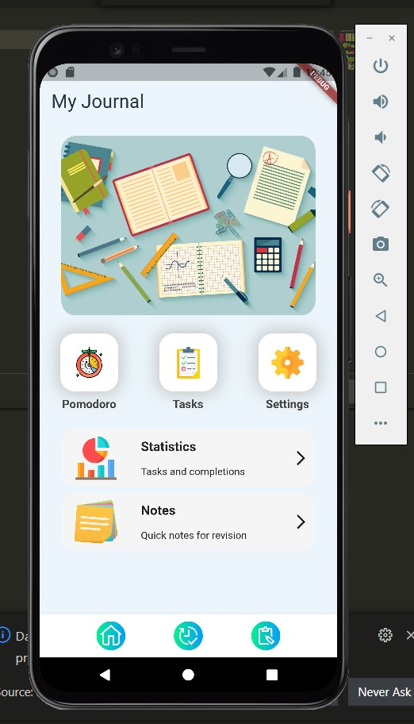

# Focused study application

Welcome to a Flutter project created by Rikraj Mandal. The project idea came from a very basic problem faced by all students. In this era of information and technology self paced studying has became very common as there are plenty of resources on internet that can teach you a lot of things. But at the same time it is very common for students to get distracted by a ton of resources that are floating around the web. This application can help you get the most out of your study time.

## Getting Started

The application is divided into two main portions

- Capturing potential tasks you wish to complete
- Focused time for studying using a famous technique created by Francesco Cirillo named 'Pomodoro technique'

### Task capturing

Task capturing is simply a todo list page where you can capture all your tasks that you want to get done. It is implemented using SQL database, so that it gets stored and can be accessed in future.

### Pomodoro timer

It is a stop watch that counts 25 minutes time for each study session so that you can focus your time in one task at a time. Data is fetched from todo list database and used to present status of your study time.

